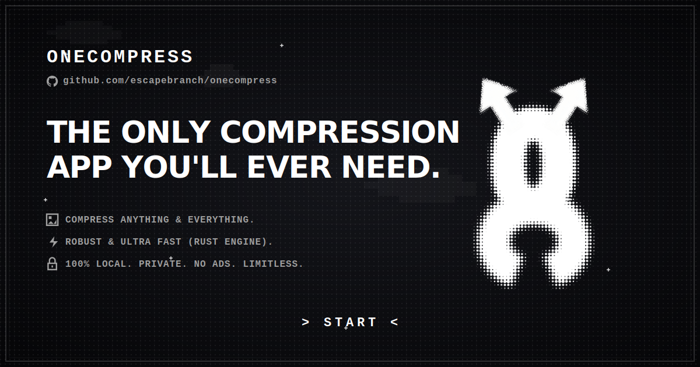

OneCompress is a high-performance, local-first media compression app built with Flutter and Rust. It pairs a fluid Material 3 Flutter UI with a multi-threaded Rust core to execute heavy image processing operations completely on-device.

## Key Capabilities

- **100% Offline & Private**: All image operations execute locally. No cloud servers, no network requests, no user tracking.
- **High-Throughput Native Core**: Rust engine connected via `flutter_rust_bridge` (v2) for low-overhead multi-threaded compression.
- **Resilient Fallback System**: Automatic detection of native libraries. If native binaries are absent, the application gracefully routes image tasks to an internal Dart raster fallback without interrupting the user.
- **Interactive Visual Inspector**: Split-screen before/after comparison slider with real-time zoom and size delta metrics.
- **Batch Processing**: Parallel compression for JPEG, PNG, and WebP formats with custom presets and dimension controls.

## System Architecture

The project follows Clean Architecture principles, establishing a clear separation between application state, domain logic, data sources, and native FFI components:

```text
lib/
├── app/                        Application bootstrap and dependency injection root
├── core/                       Design system, theme tokens, shared widgets, utilities
└── features/
    └── image_compression/
        ├── domain/             Core business logic, entities, repository interfaces
        ├── data/               FFI Rust engine bindings, fallback worker, gallery saver
        └── presentation/       UI pages, image comparison slider, preset pickers

rust/
└── image_engine/               Native Rust compression engine and memory management
```

## Quick Start

The fastest way to launch the application on any development machine is using the primary Make target:

```bash
make run
```

This single command automatically exports local toolchain paths, compiles the native Rust engine for your active environment, and boots the Flutter app in debug mode.

## Launching Across Platform Environments

### Linux & macOS

1. Fetch Dart dependencies:
   ```bash
   flutter pub get
   ```

2. Run the automated launcher:
   ```bash
   make run
   ```

Alternatively, if you prefer running Flutter directly for desktop:
```bash
make rust-engine-debug
flutter run -d linux # or macos
```

### Windows

If running inside Git Bash or WSL:
```bash
make run
```

If running inside standard Windows PowerShell:
1. Build the Rust native library:
   ```powershell
   cargo build --manifest-path rust/image_engine/Cargo.toml
   ```
2. Launch Flutter:
   ```powershell
   flutter run -d windows
   ```

### Android Device or Emulator

Ensure your Android device or emulator is connected (`flutter devices`):

```bash
make run
```

`make run` automatically invokes `./tool/build_rust_android.sh debug` to compile native `.so` binaries for all required Android ABIs (`arm64-v8a`, `armeabi-v7a`, `x86_64`) before launching on the target device.

### iOS & macOS Native Builds

For iOS simulators or physical iPhones, compile the Apple static targets first:

```bash
./tool/build_rust_apple.sh debug
flutter run -d ios
```

## Important Development Notes

### Native Toolchain Setup

To cross-compile the Rust engine for mobile targets, install the necessary target toolchains via `rustup`:

```bash
# Android target ABIs
rustup target add aarch64-linux-android armv7-linux-androideabi x86_64-linux-android

# Apple targets
rustup target add aarch64-apple-ios aarch64-apple-ios-sim x86_64-apple-ios aarch64-apple-darwin x86_64-apple-darwin
```

### Android NDK Environment Variable

When compiling Android native libraries, ensure your NDK path is set:

```bash
export ANDROID_NDK_HOME="$HOME/Android/Sdk/ndk/25.2.9519653"
```

### Seamless Dart Fallback

If you run `flutter run` directly without building the Rust native libraries, OneCompress will detect the missing native symbol bindings at runtime and log an informational message. It then transparently redirects all image processing tasks to the Dart raster engine (`image` package). Development work on UI or application logic can continue without needing a working Rust cross-compilation toolchain on hand.

## Makefile Command Reference

| Command | Description |
|---|---|
| `make run` | Primary dev launcher. Compiles native engine and starts Flutter. |
| `make rust-engine-debug` | Builds Rust engine debug binary for host desktop platform. |
| `make rust-engine-release` | Builds Rust engine optimized release binary. |
| `make android-rust-debug` | Cross-compiles native `.so` libraries for Android targets. |
| `make frb-codegen` | Regenerates FFI bridge bindings using `flutter_rust_bridge_codegen`. |
| `make flutter-check` | Runs static analysis (`flutter analyze`) and unit test suite (`flutter test`). |
